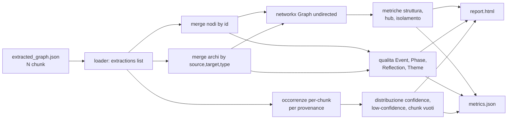

# Guida a `extraction_analysis.py`
#production 
> Strumento di analisi del knowledge graph prodotto dallo stadio 3 (`data/stage_3/full_runs/<datetime>/extracted_graph.json`). Genera un report HTML con figure Plotly + un sidecar JSON ispezionabile da CLI.
> Ultimo aggiornamento: vista globale deduplicata, 9 sezioni, vista non orientata per il grado.

---

## Scopo

Rispondere in modo rapido e ripetibile alle domande di igiene strutturale del grafo estratto, senza dover aprire Neo4j. È il "cruscotto" tra stadio 3 (estrazione) e stadio 3.5 (caricamento) / stadio 4 (resolve):

- **conta** nodi e archi totali e per tipo (allineato a `src/schema.py`);
- **identifica gli hub** (top by degree globale, top per tipo, anomalie a grado 1);
- **misura l'isolamento** (nodi orfani, orfani-rispetto-ad-Adriano, componenti connesse, dimensione del cluster gigante);
- **fa quality-check sugli Event** (Event senza Place, senza Phase, senza altra Person oltre Adriano, senza Theme, con sola connessione ad Adriano, con grado anomalmente alto);
- **valuta la spina dorsale Phase** (Phase ordinate per numero di Event ancorati via `DURING`, Phase isolate, catene `TRANSFORMS_INTO`, top Event senza `DURING`);
- **analizza le Reflection** (distribuzione per chunk, REFLECTS_ON orfane, distribuzione dei tipi di target);
- **misura la "trama" tematica** (Theme per numero di `EMBODIES` entranti, Theme citati una volta sola, top 10);
- **conta gli archi narrativi** (ECHOES, CAUSED, FOLLOWS, CONTRASTS_WITH, TRANSFORMS_INTO, RELATED_TO; reciprocità degli ECHOES; rapporto CAUSED/FOLLOWS);
- **valuta la provenienza** (distribuzione delle `confidence` per occorrenze, conteggi sotto-soglia, nodi/archi low-confidence per tipo, chunk con zero estrazioni).

Non sostituisce stadio 4 (resolve): **non rinomina nodi**, **non fonde duplicati semantici** (Antinoo con due id diversi), non scrive su Neo4j. Si limita a leggere il JSON, deduplicare per `id` letterale e contare/visualizzare.

---

## Modello dati: vista globale deduplicata

Input: `extracted_graph.json`, envelope con header (`source`, `created_at`, `stage_version`, `schema_version`, `prompt_version`, `model`, `total_chunks_processed`, `params`) e lista `extractions = [{chunk_id, nodes, edges}, ...]`.

Lo stesso nodo (es. `adriano`, `roma`, `antinoo`) compare in N chunk con N copie. Lo strumento **deduplica**:

- **nodi** per `id`: un unico nodo globale con `chunks = {ch_0001, ch_0002, ...}` come insieme dei chunk in cui appare; viene segnalato un warning se in due chunk diversi un id porta un `type` diverso (debito per stadio 4);
- **archi** per tripla `(source_id, target_id, type)`: una tripla unica conta una volta nel grafo, anche se compare in molti chunk.

Sopra questa vista deduplicata si costruisce un `networkx.Graph` **non orientato**. Tutte le metriche di "grado" usano questa vista: `degree(n)` = numero di triple uniche in cui `n` compare come `source` o `target`. Le metriche intrinsecamente orientate (Event senza `LOCATED_AT` in uscita, target di `REFLECTS_ON`, catene `TRANSFORMS_INTO`) lavorano direttamente sulla tabella degli archi.

**Eccezione**: le statistiche di provenance (sezione 9) sono calcolate sulle **occorrenze per-chunk**, non sulla vista deduplicata. Ogni estrazione è una decisione separata del modello, quindi `adriano` estratto in 310 chunk pesa 310 volte nella distribuzione di `confidence`.



---

## Le 9 sezioni del report

Ogni sezione segue lo stesso schema: breve commento testuale → una o due figure Plotly → tabelle `<details>` collassabili con le liste complete. Il file HTML è self-contained, plotly.js da CDN.

### 1. Conteggi e distribuzioni
Bar chart dei nodi totali e per tipo (`Person`, `Event`, `Place`, `Phase`, `Theme`, `Reflection`, `Work`) e degli archi totali e per tipo (`INVOLVES`, `LOCATED_AT`, `DURING`, `CREATED`, `RELATED_TO`, `EMBODIES`, `REFLECTS_ON`, `ECHOES`, `CONTRASTS_WITH`, `TRANSFORMS_INTO`, `CAUSED`, `FOLLOWS`). Eventuali tipi fuori-schema vengono segnalati esplicitamente.

### 2. Hub e centralità
- **Top 30 nodi by degree** (vista non orientata) come bar orizzontale ordinato.
- **Top 10 per tipo** in subplot 2x2: `Person`, `Place`, `Theme`, `Phase`.
- **Anomalie**: `Person` e `Place` con grado 1 (di solito o entità di passaggio o sotto-estrazione).

### 3. Isolamento e connettività
- nodi con `degree == 0` (dovrebbero essere zero per costruzione, è una sentinella di sanità);
- nodi connessi *solo* ad Adriano (vicini di grado 1 il cui unico arco va al nodo `adriano`);
- **componenti connesse** via `networkx.connected_components`: istogramma delle dimensioni + dimensione della componente gigante + frazione di nodi nel gigante.

### 4. Qualità degli Event
Per ogni nodo di tipo `Event` controlla, in uscita, se manca:
- `LOCATED_AT` verso un `Place`;
- `DURING` verso una `Phase`;
- `INVOLVES` verso una `Person` diversa da `adriano`;
- `EMBODIES` verso un `Theme`;
- inoltre se l'Event ha `INVOLVES` *solo* verso Adriano;
- inoltre se il grado supera `--event-high-degree` (default 10): scene possibilmente mal estratte / troppo dense.

### 5. Phase come spina dorsale
- bar chart delle Phase ordinate per numero di Event con `DURING` entrante;
- Phase con `≤2` Event ancorati (probabili Phase sottousate / da rivedere);
- **catene `TRANSFORMS_INTO`** Phase→Phase: estratte come componenti deboli del subgrafo orientato indotto, esposte come sequenze ordinate topologicamente;
- top Event by degree senza `DURING` (cross-check con la sezione 2: spesso sono Event-cardine dimenticati).

### 6. Reflection
- istogramma del **numero di Reflection per chunk** (310 chunk → distribuzione discreta);
- Reflection senza `REFLECTS_ON` in uscita (dovrebbero essere zero per definizione di Reflection nel prompt);
- bar chart della **distribuzione per tipo del target** di `REFLECTS_ON` (Event, Theme, Person, Phase, Place, Work).

### 7. Theme
- bar chart dei top 30 Theme per numero di `EMBODIES` entranti (Event + Person);
- Theme con grado 1 (citati una sola volta → possibile sotto-estrazione o tema effimero);
- top 10 come "trama" — leggibili come le idee astratte attorno a cui ruota la vita narrata.

### 8. Archi narrativi
Bar chart compatto con i conteggi di `ECHOES`, `CAUSED`, `FOLLOWS`, `CONTRASTS_WITH`, `TRANSFORMS_INTO`, `RELATED_TO`. Per `ECHOES`: numero di **coppie reciproche** (entrambe le direzioni presenti). Rapporto **`CAUSED / FOLLOWS`** in testo: dice qualcosa sullo stile narrativo (causale denso vs sequenziale).

### 9. Provenienza
Calcolata sulle **occorrenze per-chunk**, non sui nodi/archi deduplicati.
- statistiche complete della `confidence` per nodi e archi: `count`, `missing`, `mean`, `median`, `min`, `max`, `p10`, `p25`, `p75`, `p90`;
- conteggi sotto-soglia per `<0.5`, `<0.7`, `<0.9` (per riconoscere zone d'ombra del modello);
- **istogramma sovrapposto** di nodi vs archi, con linea verticale sulla soglia bassa;
- **composizione per tipo** dei nodi/archi sotto la soglia bassa (`--low-confidence`, default 0.5);
- **liste top-N** dei low-confidence con `confidence`, `id/triple`, `chunk_id` e `evidence_span` troncato;
- **chunk con zero estrazioni**: chunk presenti in `extractions` con `nodes=[]` e `edges=[]`.

> Avvertenza interpretativa: la `confidence` dichiarata dall'LLM è notoriamente auto-stimata alta. La distribuzione di Yourcenar ha mediana 0.90 per entrambi nodi e archi. È un segnale **relativo** (dove il modello esita) più che assoluto.

---

## Output

Due file in `--output-dir` (default `Adriano_graph/data/output/extraction_analysis/`):

- **`report.html`** — file unico self-contained (~500-600 KB), plotly.js da CDN, 14 figure totali, 9 sezioni navigabili da link in cima al documento. Nel report ogni tabella lunga è dentro un `<details>` collassabile.
- **`metrics.json`** — dump strutturato dei numeri grezzi:
  ```text
  input, header, adriano_id, event_high_degree_threshold, low_confidence_threshold,
  counts, hubs, isolation, event_quality, phases, reflections, themes,
  narrative_arcs, provenance, warnings
  ```
  Ispezionabile da riga di comando con `python -c "import json; ..."`, `jq`, Cursor, ecc. Le `provenance.evidence_span` sono incluse troncate per non gonfiare il file; i valori grezzi `confidence` sono persi (ricalcolabili rilanciando lo script).

---

## CLI

```
python Adriano_graph/tools/extraction_analysis.py [opzioni]
```

| Opzione | Default | Descrizione |
|---|---|---|
| `-i`, `--input PATH` | `data/stage_3/full_runs/18-05-2026_16-51/extracted_graph.json` | `extracted_graph.json` di input (envelope con `extractions`). |
| `-o`, `--output-dir DIR` | `data/output/extraction_analysis/` | Cartella destinazione. Viene creata se non esiste. |
| `--adriano-id ID` | `adriano` | ID canonico del nodo Adriano. Usato dalle sezioni "orfani-rispetto-ad-Adriano" e "Event solo-Adriano". |
| `--event-high-degree N` | `10` | Soglia oltre la quale un Event è considerato "anomalmente denso". |
| `--low-confidence THRESHOLD` | `0.5` | Soglia sotto cui un'occorrenza è considerata low-confidence (sezione 9). |
| `--print` | (off) | Stampa anche un riassunto leggibile su stdout, oltre ai file. |

---

## Esempi di utilizzo

### Esecuzione di default
Usa il file di full-run più recente, scrive in `data/output/extraction_analysis/`:

```powershell
python Adriano_graph/tools/extraction_analysis.py
```

### Run con sommario su stdout
Utile in iterazione, per leggere i numeri chiave senza aprire l'HTML:

```powershell
python Adriano_graph/tools/extraction_analysis.py --print
```

### Analisi di un altro full-run
Per confrontare prompt-version diverse, cambia solo l'input e l'output:

```powershell
python Adriano_graph/tools/extraction_analysis.py `
  -i Adriano_graph/data/stage_3/full_runs/2026-06-15_run_b/extracted_graph.json `
  -o Adriano_graph/data/output/extraction_analysis_run_b
```

### Alzare la soglia di "Event denso" e di "low-confidence"
Per vedere più Event sospetti e più nodi/archi a confidence intermedia (le coda della distribuzione):

```powershell
python Adriano_graph/tools/extraction_analysis.py `
  --event-high-degree 8 `
  --low-confidence 0.7 `
  --print
```

### Cambiare l'ID di riferimento "Adriano"
Se in futuro lo strumento gira su un altro dominio (caso clinico, altra biografia), basta cambiare l'id del protagonista:

```powershell
python Adriano_graph/tools/extraction_analysis.py --adriano-id paziente_x
```

### Ispezione programmatica del JSON
Dopo l'esecuzione, i numeri sono interrogabili senza aprire l'HTML:

```powershell
python -c "import json; d = json.load(open(r'Adriano_graph/data/output/extraction_analysis/metrics.json', encoding='utf-8')); print(d['counts']['by_node_type'])"

python -c "import json; d = json.load(open(r'Adriano_graph/data/output/extraction_analysis/metrics.json', encoding='utf-8')); print(d['provenance']['node_confidence'])"

python -c "import json; d = json.load(open(r'Adriano_graph/data/output/extraction_analysis/metrics.json', encoding='utf-8')); print(len(d['event_quality']['missing_phase']))"
```

### Help della CLI
Ricapitola opzioni e default correnti:

```powershell
python Adriano_graph/tools/extraction_analysis.py --help
```

---

## Lettura del report — domande tipiche e dove trovarle

| Domanda | Sezione | Chiave in `metrics.json` |
|---|---|---|
| Quanti nodi per tipo? | 1 | `counts.by_node_type` |
| Quali archi sono usati di più? | 1, 8 | `counts.by_edge_type`, `narrative_arcs.counts` |
| Chi sono i 5 personaggi più centrali? | 2 | `hubs.top_by_type.Person` |
| Ci sono Person/Place citati una sola volta? | 2 | `hubs.degree_one_person`, `hubs.degree_one_place` |
| Quanti nodi sono connessi solo ad Adriano? | 3 | `isolation.orphans_to_adriano_total` |
| Il grafo è in un solo pezzo? | 3 | `isolation.components_count`, `isolation.giant_component_fraction` |
| Quanti Event mancano della loro Phase? | 4 | `event_quality.missing_phase_count` |
| Quali Event sono troppo densi? | 4 | `event_quality.high_degree` |
| Le Phase formano una sequenza? | 5 | `phases.transforms_chains` |
| Quali Reflection sono orfane? | 6 | `reflections.orphan_reflections` |
| Su cosa riflette Adriano? | 6 | `reflections.reflects_on_target_types` |
| Quali sono i temi-trama? | 7 | `themes.top_themes` |
| Quanti CAUSED vs FOLLOWS? | 8 | `narrative_arcs.counts.CAUSED`, `.FOLLOWS`, `.caused_follows_ratio` |
| Dove esita il modello? | 9 | `provenance.low_nodes_top`, `provenance.low_edges_top` |
| Ci sono chunk senza estrazioni? | 9 | `provenance.empty_chunks_count` |

---

## Dipendenze

- `plotly` (installato esplicitamente; usato `plotly.graph_objects` e `plotly.subplots`, niente `pandas`);
- `networkx` (già in `environment.yml`, v3.4.2);
- standard library: `argparse`, `json`, `collections`, `pathlib`.

Nessuna chiamata a LLM o a Neo4j. Lo strumento è puramente *offline* sui file di stadio 3.

---

## Limiti noti

- **Dedup per id letterale**, non per nome: se la stessa entità appare come `antinoo` in 30 chunk e come `antinoo_di_bitinia` in 1, contano come due nodi distinti. È compito di stadio 4.
- **Grafo non orientato per il grado**: la direzionalità si perde nei conteggi `degree`. Per le metriche che dipendono dalla direzione (LOCATED_AT, DURING, REFLECTS_ON, TRANSFORMS_INTO) si usa la tabella archi direttamente, non `nx.Graph`.
- **Provenienza basata su `confidence` self-rated**: l'autovalutazione del modello è alta per costruzione. Trattare le sotto-soglie come segnali relativi, non assoluti.
- **Nessun cross-check con `data/stage_2/chunks.json`**: la sezione 9 considera "chunk con zero estrazioni" solo i chunk presenti in `extractions` con liste vuote. Eventuali chunk persi nello stadio 3 (mancanti del tutto dall'envelope) andrebbero verificati confrontando `header.total_chunks_processed` con `len(extractions)`.
