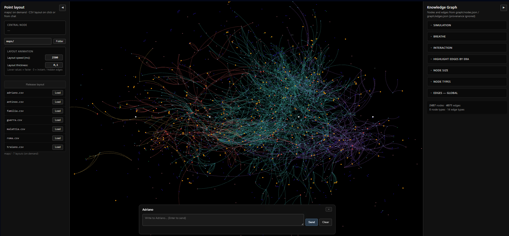
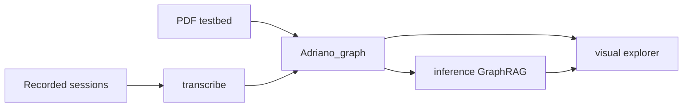

# Storie

A pipeline that turns a life story into a **navigable knowledge graph** and a **first-person conversational agent**.

The intended product is a premium biography: recorded sessions become a graph you can explore, plus an LLM that speaks as the subject — grounded in that graph, not in a generic prompt. The working prototype uses *Memoirs of Hadrian* (Yourcenar) as a dense literary stand-in for oral history.


| Graph (enriched)                  | Index                      | Explorer                            |
| --------------------------------- | -------------------------- | ----------------------------------- |
| **2,488** nodes · **4,691** edges | **310** chunks, hybrid RAG | static `visual/` viewer + chat dock |


 

## Architecture




| Module           | Role                                                                                                                                                            |
| ---------------- | --------------------------------------------------------------------------------------------------------------------------------------------------------------- |
| `transcribe/`    | Audio → dialogue transcript (WhisperX, diarization, optional LLM recap). Production input path.                                                                 |
| `Adriano_graph/` | Staged extraction, resolution, enrichment, and indexing. Idempotent stages, Pydantic schemas, provenance on every record, health checkups with HTML dashboards. |
| `inference/`     | GraphRAG agent: BGE-M3 retrieval + 1-hop graph context → local LM Studio or a remote API. FastAPI + SSE.                                                        |
| `visual/`        | Force-directed explorer (layouts, eras, chat). Static site; chat talks to `inference/`.                                                                         |


## Pipeline

Stages 0–6 in `Adriano_graph/`. Design notes and ADRs: `[Adriano_graph/PIPELINE.md](Adriano_graph/PIPELINE.md)`.


| Stage   | What it does                                                                      |
| ------- | --------------------------------------------------------------------------------- |
| **0–2** | Extract / clean / chunk. PDF today; transcription later.                          |
| **3**   | LLM extraction per chunk (Claude) → typed nodes and edges.                        |
| **4**   | Entity resolution: merge, split type collisions, canonical graph.                 |
| **5**   | Cross-chunk enrichment: theme hierarchy, `EMBODIES`, `ECHOES`, `TRANSFORMS_INTO`. |
| **6**   | Hybrid RAG index (vectors + graph) consumed by `inference/`.                      |


Node types: `Person`, `Event`, `Place`, `Phase`, `Theme`, `Reflection`, `Work`, `Era`.  
Relations include `INVOLVES`, `REFLECTS_ON`, `DURING`, `LOCATED_AT`, `EMBODIES`, `ECHOES`, `SPECIALIZES`.

## Graph explorer

No Python required:

```powershell
python -m http.server 8080 --directory visual
```

Then open [http://localhost:8080](http://localhost:8080). Click a node for details; right-click to highlight the neighbourhood; use the left panel for geographic / thematic layouts (`visual/maps/`).

Chat in the dock needs the inference server (below). The viewer is also set up for a static host (`visual/netlify.toml`).

## Conversational agent

Retrieval is hybrid: embedding search over chunks, then a 1-hop walk on the enriched graph. The model answers **in the first person**, as Hadrian.
If the agent recognizes certain topics, it will rearrange the graph as it speaks.


```powershell
# env adriano-kg, from inference/
python server.py                  # LM Studio on localhost:1234
python server.py --use_API groq   # or a remote provider from the root .env
```

CLI alternative: `python chat.py`. Config: `inference/config.yaml`. Env template: `[.env.example](.env.example)`.

Point the embedder at a local [BGE-M3](https://huggingface.co/BAAI/bge-m3) checkout, or keep the Hugging Face id. Set `EMBED_MODEL` / `EMBED_DEVICE` in `.env` (paths are relative to the repo root). Default device is CUDA.

## Setup

**Knowledge graph + inference** (Python 3.10, CUDA build of PyTorch):

```powershell
micromamba create -f environment.yml
micromamba activate adriano-kg
# or: python -m venv .venv  &&  pip install -r requirements.txt
```

Windows helper: `.\envs\install_kg.ps1`.

**Transcription** is a separate env (`transcribe/environment.yml`) — WhisperX and the KG stack do not share a torch build.

Secrets stay in a single `.env` at the repo root (gitignored). Copy `.env.example` → `.env` and fill in keys and local paths.

## Layout

```
Adriano_graph/   pipeline stages 0–6, schemas, Neo4j import, tools
inference/       GraphRAG server and CLI
visual/          explorer (static)
transcribe/      oral-history ingestion
envs/            micromamba install scripts
```


## Status

Working prototype: stages 0–5 done and checked; stage 6 index built; explorer and chat usable locally. Not a packaged product — GPU, local models, and API keys are assumed.

## Source material

Test corpus: *Mémoires d'Hadrien* / *Memorie di Adriano* by Marguerite Yourcenar, Italian translation by Lidia Storoni Mazzolani. Used here as a personal, non-commercial stand-in for a spoken biography. The novel is still under copyright; this repository is not a licensed distribution of the source.